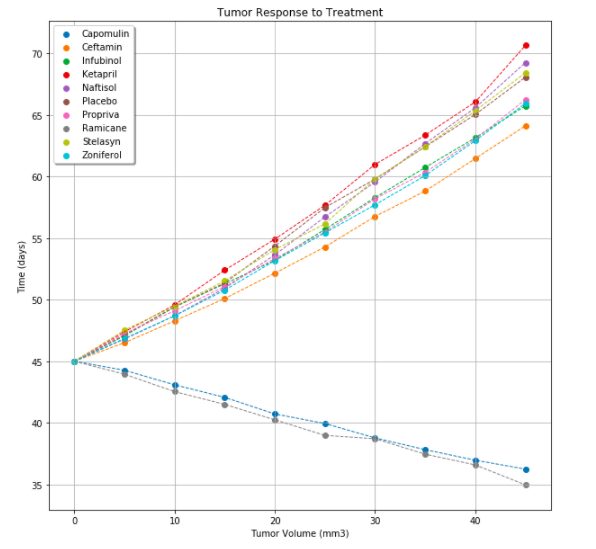
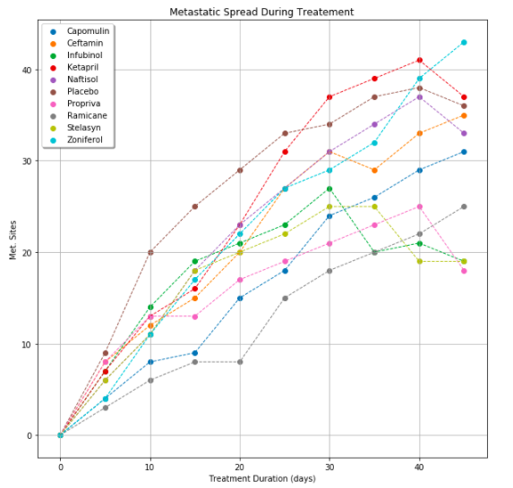
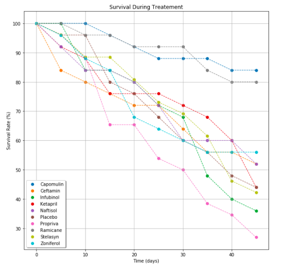
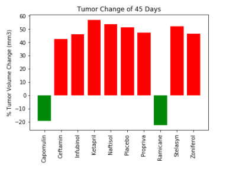
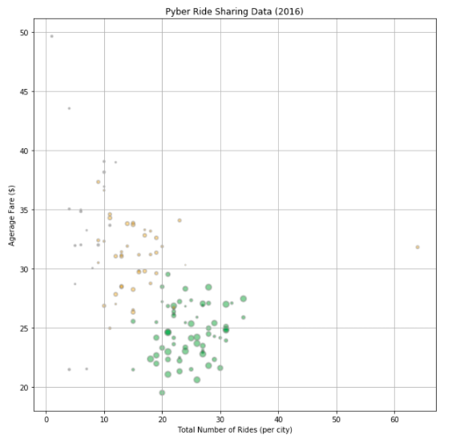
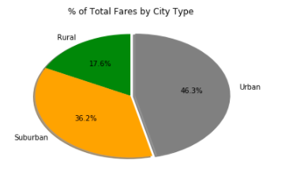

# Matplotlib
1) An analysis the physiological responses of mice to cancer treatments 2. An analysis of ride sharing data. 

# Pymaceuticals Inc
In this study, 250 mice were treated through a variety of drug regimes over the course of 45 days. Their physiological responses were then monitored over the course of that time. The objective is to analyze the data to show how four treatments (Capomulin, Infubinol, Ketapril, and Placebo) compare.

The Pymaceutical notebook includes:

-A scatter plot that shows how the tumor volume changes over time for each treatment.

-A scatter plot that shows how the number of metastatic (cancer spreading) sites changes over time for each treatment.

-A scatter plot that shows the number of mice still alive through the course of treatment (Survival Rate)

-A bar graph that compares the total % tumor volume change for each drug across the full 45 days.

# Pyber 

The ride sharing bonanza continues! An analysis of the ride sharing company's complete recordset of rides. This contains information about every active driver and historic ride, including details like city, driver count, individual fares, and city type.

The Pyber notebook includes:

- A Bubble Plot that showcases the relationship between four key variables:

Average Fare ($) Per City
Total Number of Rides Per City
Total Number of Drivers Per City
City Type (Urban, Suburban, Rural)

- A Pie Chart that highlights % of Total Fares by City Type

